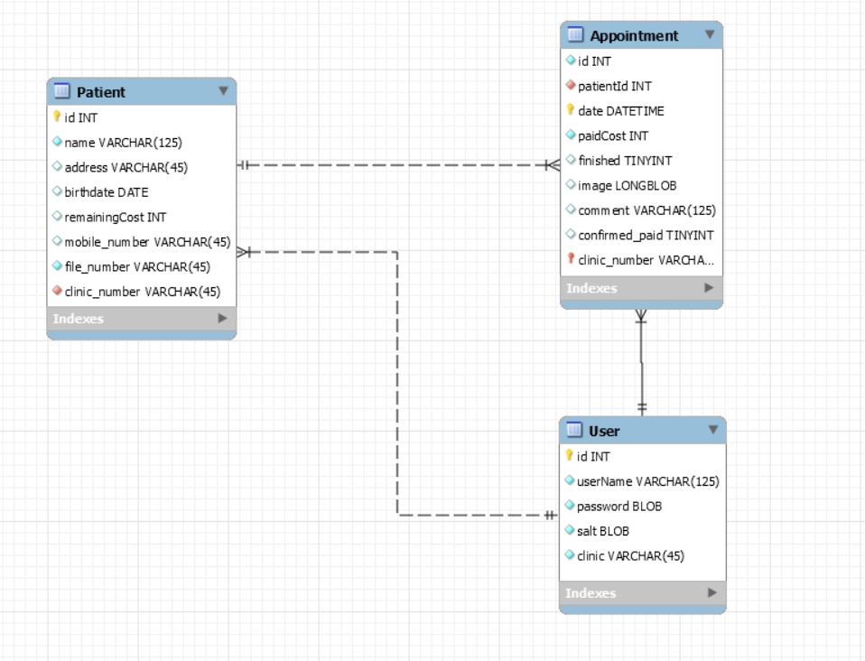
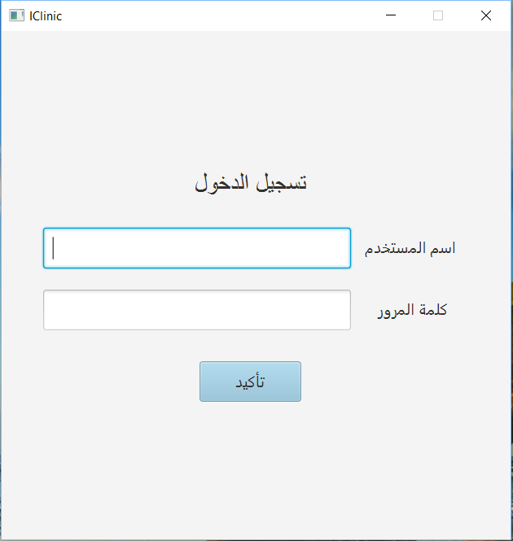
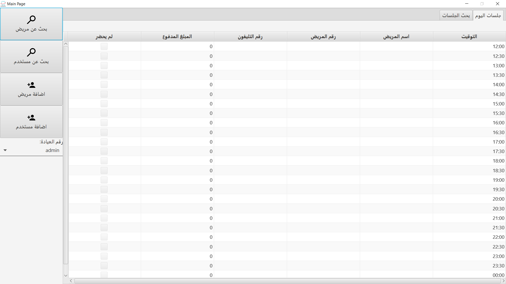
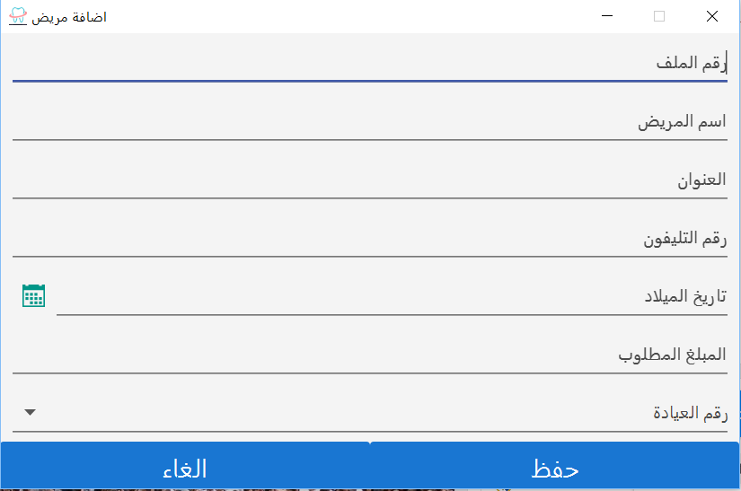
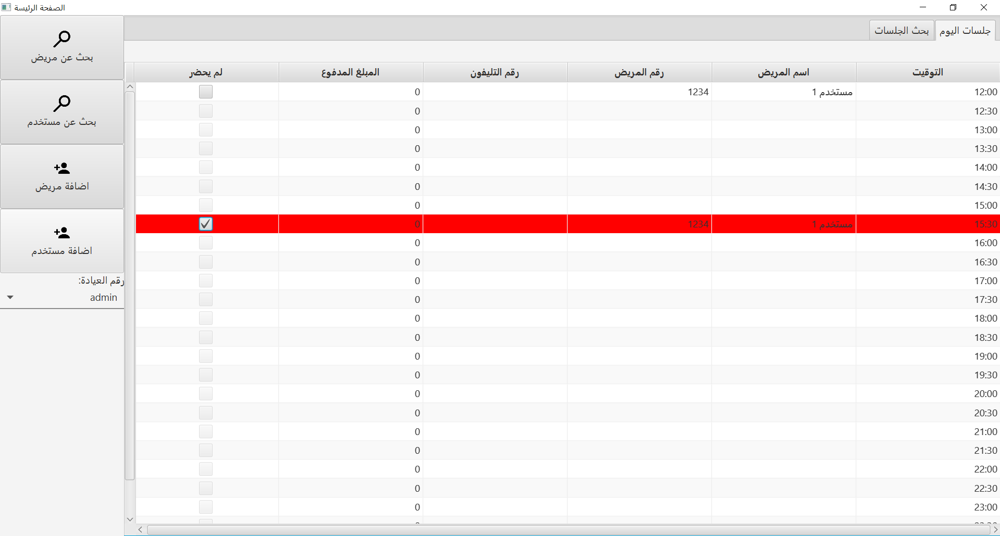
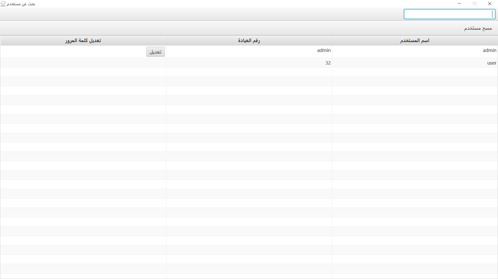
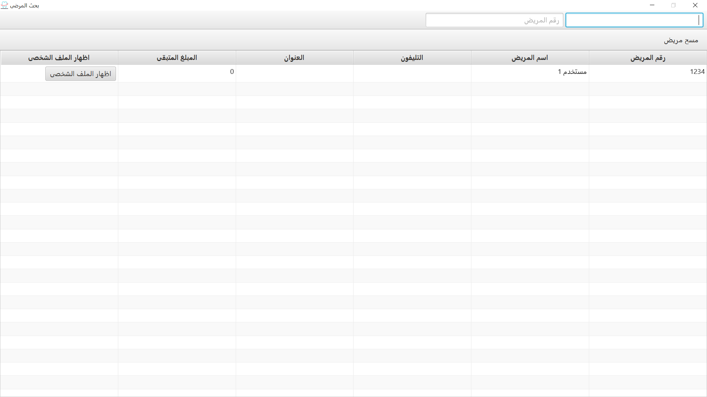

# IClinic
A java application with arabic UI to manage a clinic system including patients history and comming sessions of patients among several doctors in the same clinic. So IClinic is mainly designed to automate internal work flows and manage different aspect of a small to medium size medical clinics.

# Database ERD

# Setup
1. Download [JAR](https://github.com/AmrHendy/IClinic/blob/master/jar/IClinic.jar) from jars folder.
2. `Setup database` You need to create the database using [SQL script](https://github.com/AmrHendy/IClinic/blob/master/sql/IClinic.sql).
3. Now you can run the JAR.
4. IClinic application requires the user to log in using a username/password pair. The default values are:
> * username: admin 
> * password: admin

`Tested on Windows 8 and 10 with java 10`

# How To Use
1. log in in with the default username/password.
2. A new patient can be added with basic personal details:
3. Upon selecting the patient from a list more fields become visible allowing the user to edit comments, appointments, etc.
4. Photos can be uploaded to / downloaded from the application.
5. A patient record can be deleted after the practitioner confirms its deletion.
6. The list of patients can be search based on a series of fields. (Only sensible fields are included in the search area).

# Screen shots
* Sign In page.

  

* Main page to manage current day session (the client has 24 session each of them is about 30 min).

  

* Adding New Patient.

  

* Manage session by editing the price for each session, also marking each session if the client didn't come to remember to call him/her later.

  

* Searching users (we make the search for patients is possible using several options, we search for the patients assigned to the logged in user/doctor only for more privacy).

  

* Searching for patients and editing their own profiles that represents their previous session and also a description for their medical records with an image for it.

  

# Credits
* [Amr Hendy](https://github.com/AmrHendy)
* [Arsanuos Essa](https://github.com/Arsanuos)

# Licence
This project is licensed under GNU General Public License v3.0 - see the [LICENSE](LICENSE) file for details

